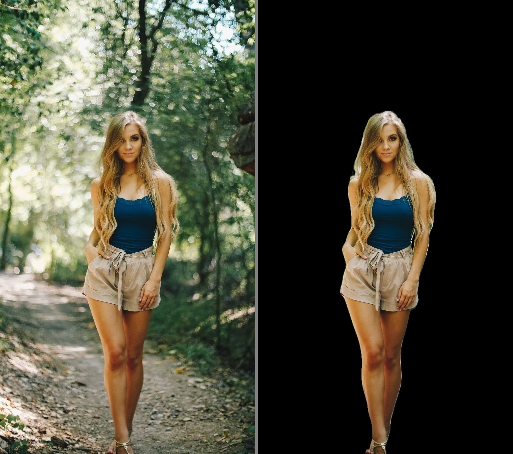

# Human Image Segmentation using DeepLabV3+ 
## Dataset
Download the dataset: [Person Segmentation](https://www.kaggle.com/nikhilroxtomar/person-segmentation/download)

## Weight file
Download the weight files from here: [model.h5](https://drive.google.com/file/d/17QKxSIBFhyJoDps93-sCVHnVV6UWS1sG/view?usp=sharing)

## Architecture

- Squeeze-and-Excitation (SE) is a proposed method to enhance the learning capability and representational power of deep learning models, especially in convolutional neural networks (CNNs).
- The main idea of SE is to focus on modeling the dependencies between the channels of the input feature and the importance of information within each channel. SE achieves this by using a pair of "squeeze" and "excitation" operations to generate a weight for each channel.

## Quantitative results
These results are on the validation/test set.
| Accuacy | F1 | Jaccard | Recall | Precision |
| :---: | :---: | :---: | :---: | :---: |
| 0.97404 | 0.95379 | 0.92124 | 0.95885 | 0.95683 |

## Qualtiative results
These qualitative results are on the validation/test set. The figure consists of:
- Input Image - Masked Image

## Use this code:
- Download dataset and put it in folder **people_segmentation**
- Run file data.py to create newdata
